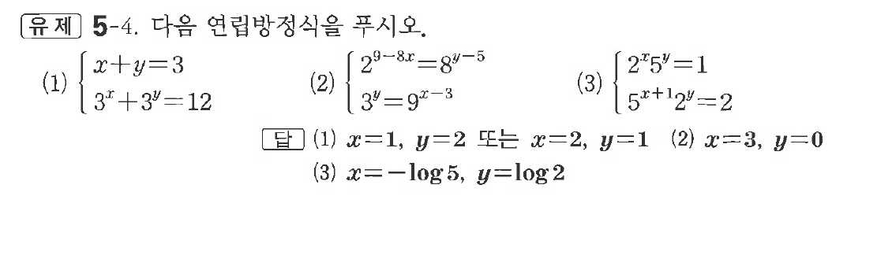

# 유제 5-4

## 문제

다음 연립방정식을 푸시오.

(1) $\begin{cases}x+y=3\\3^x+3^y=12\end{cases}$

(2) $\begin{cases}2^{9-3x}=8^{y-5}\\3^y=9^{x-3}\end{cases}$

(3) $\begin{cases}2^x5^y=1\\5^{x+1}2^y=2\end{cases}$

## 정답

(1) $x=1,\ y=2$ 또는 $x=2,\ y=1$  
(2) $x=3,\ y=0$  
(3) $x=-\log5,\ y=\log2$

## 원문 문제

## 원문

