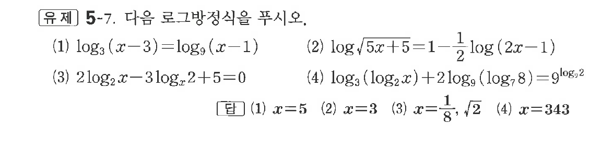

# 유제 5-7

## 문제

다음 로그방정식을 푸시오.

(1) $\log_3(x-3)=\log_9(x-1)$

(2) $\log\sqrt{5x+5}=1-\dfrac12\log(2x-1)$

(3) $2\log_2x-3\log_{x^2}2+5=0$

(4) $\log_3(\log_2x)+2\log_9(\log_78)=9^{\log_32}$

## 정답

(1) $x=5$  
(2) $x=3$  
(3) $x=\dfrac18,\ \sqrt2$  
(4) $x=343$

## 원문 문제

## 원문

