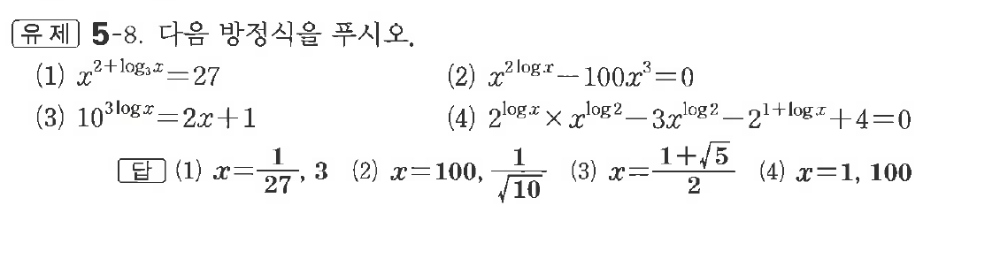
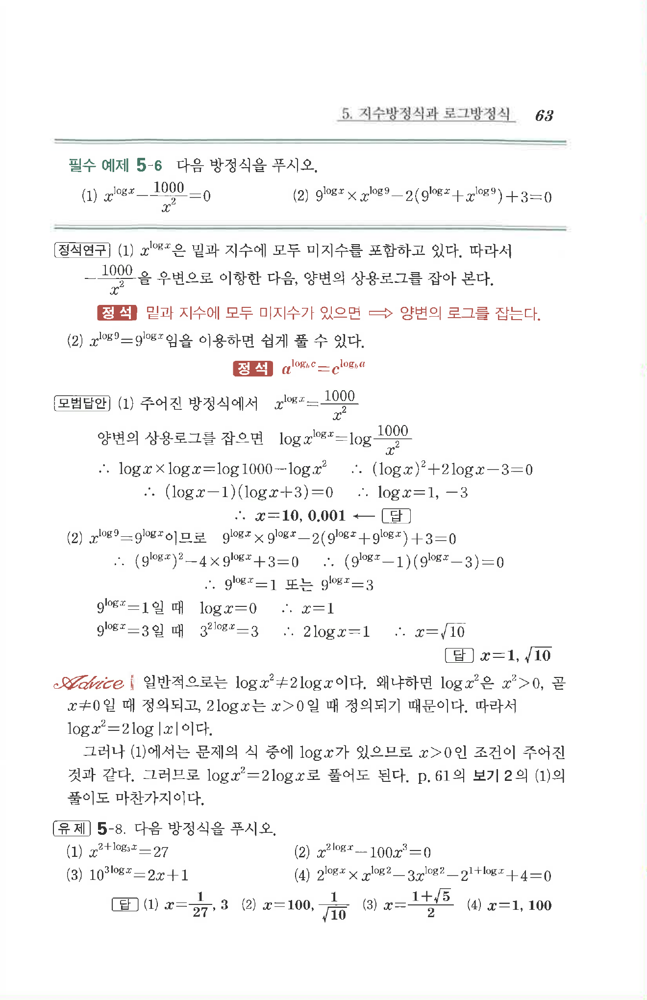

# 유제 5-8

## 문제

다음 방정식을 푸시오.

(1) $x^{2+\log_3x}=27$

(2) $x^{2\log x}-100x^3=0$

(3) $10^{3\log x}=2x+1$

(4) $2^{\log x}\times x^{\log2}-3x^{\log2}-2^{1+\log x}+4=0$

## 정답

(1) $x=\dfrac1{27},\ 3$  
(2) $x=100,\ \dfrac1{\sqrt{10}}$  
(3) $x=\dfrac{1+\sqrt5}{2}$  
(4) $x=1,\ 100$

## 원문 문제

## 원문

