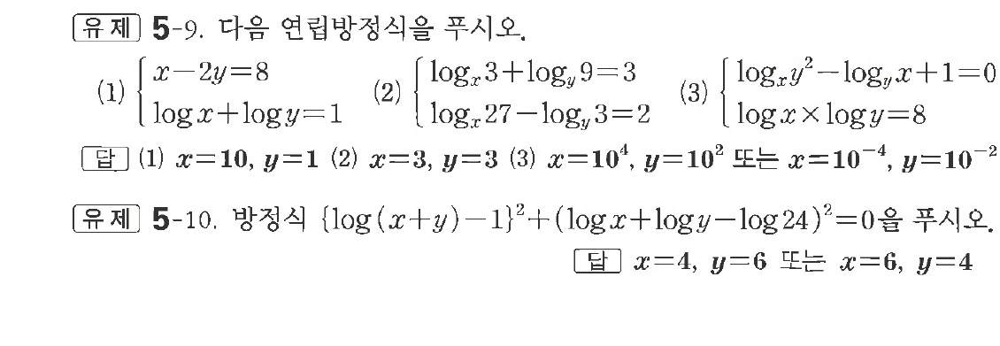
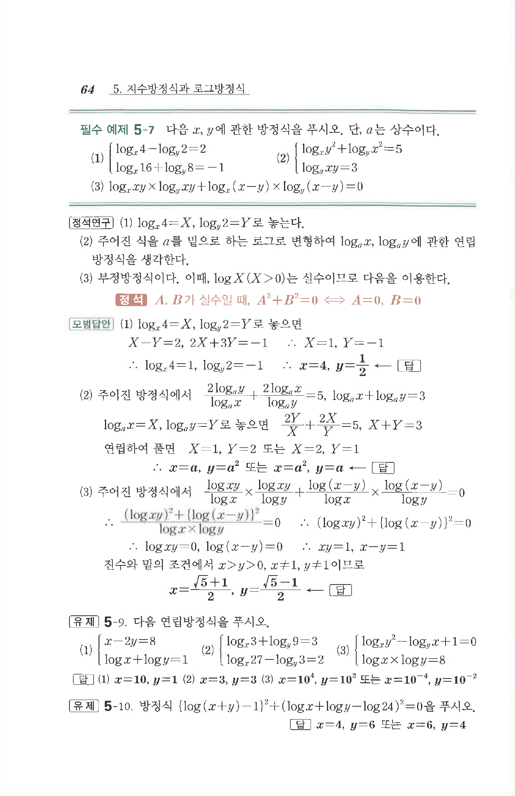

# 유제 5-9

## 문제

다음 연립방정식을 푸시오.

(1) $\begin{cases}x-2y=8\\\log x+\log y=1\end{cases}$

(2) $\begin{cases}\log_x3+\log_y9=3\\\log_x27-\log_y3=2\end{cases}$

(3) $\begin{cases}\log_xy^2-\log_yx+1=0\\\log x\times\log y=8\end{cases}$

방정식 $\{\log(x+y)-1\}^2+(\log x+\log y-\log24)^2=0$을 푸시오.

## 정답

첫 번째 문제:  
(1) $x=10,\ y=1$  
(2) $x=3,\ y=3$  
(3) $x=10^4,\ y=10^2$ 또는 $x=10^{-4},\ y=10^{-2}$

두 번째 문제: $x=4,\ y=6$ 또는 $x=6,\ y=4$

## 원문 문제

## 원문

