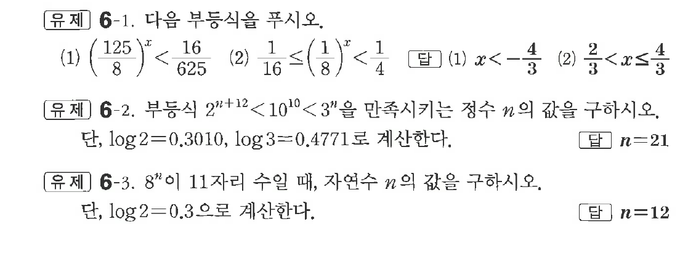

# 유제 6-1

## 문제

다음 부등식을 푸시오.

(1) $\left(\dfrac{125}{8}\right)^x<\dfrac{16}{625}$

(2) $\dfrac1{16}\le\left(\dfrac18\right)^x<\dfrac14$

부등식 $2^{n+12}<10^{10}<3^n$을 만족시키는 정수 $n$의 값을 구하시오. 단, $\log2=0.3010,\ \log3=0.4771$로 계산한다.

$8^n$이 $11$자리 수일 때, 자연수 $n$의 값을 구하시오. 단, $\log2=0.3$으로 계산한다.

## 정답

첫 번째 문제: (1) $x<-\dfrac43$  (2) $\dfrac23<x\le\dfrac43$

두 번째 문제: $n=21$

세 번째 문제: $n=12$

## 원문 문제

## 원문

