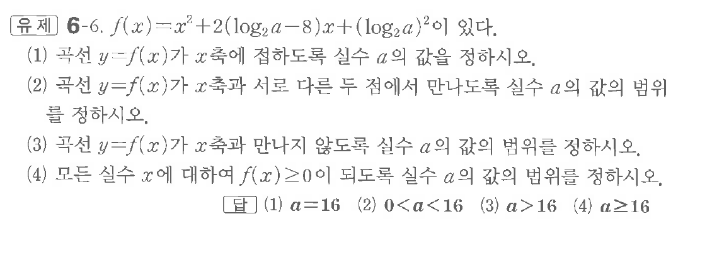

# 유제 6-6

## 문제

$f(x)=x^2+2(\log_2a-8)x+(\log_2a)^2$이 있다.

(1) 곡선 $y=f(x)$가 $x$축에 접하도록 실수 $a$의 값을 정하시오.

(2) 곡선 $y=f(x)$가 $x$축과 서로 다른 두 점에서 만나도록 실수 $a$의 값의 범위를 정하시오.

(3) 곡선 $y=f(x)$가 $x$축과 만나지 않도록 실수 $a$의 값의 범위를 정하시오.

(4) 모든 실수 $x$에 대하여 $f(x)\ge0$이 되도록 실수 $a$의 값의 범위를 정하시오.

## 정답

(1) $a=16$  
(2) $0<a<16$  
(3) $a>16$  
(4) $a\ge16$

## 원문 문제

## 원문

