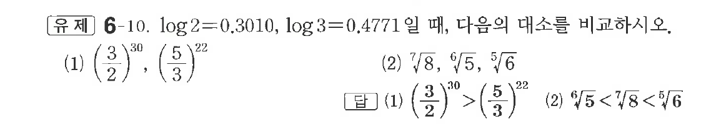

# 유제 6-10

## 문제

$\log2=0.3010,\ \log3=0.4771$일 때, 다음의 대소를 비교하시오.

(1) $\left(\dfrac32\right)^{30},\ \left(\dfrac53\right)^{22}$

(2) $\sqrt[7]{8},\ \sqrt[6]{5},\ \sqrt[5]{6}$

## 정답

(1) $\left(\dfrac32\right)^{30}>\left(\dfrac53\right)^{22}$  
(2) $\sqrt[6]{5}<\sqrt[7]{8}<\sqrt[5]{6}$

## 원문 문제

## 원문

