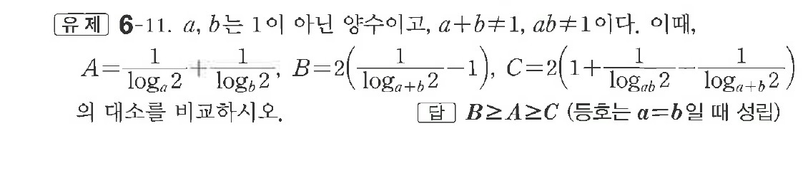

# 유제 6-11

## 문제

$a,\ b$는 $1$이 아닌 양수이고, $a+b\ne1,\ ab\ne1$이다. 이때,

$$
A=\frac1{\log_a2}+\frac1{\log_b2},\quad
B=2\left(\frac1{\log_{a+b}2}-1\right),\quad
C=2\left(1+\frac1{\log_{ab}2}-\frac1{\log_{a+b}2}\right)
$$

의 대소를 비교하시오.

## 정답

$B\ge A\ge C$ (등호는 $a=b$일 때 성립)

## 원문 문제

## 원문

