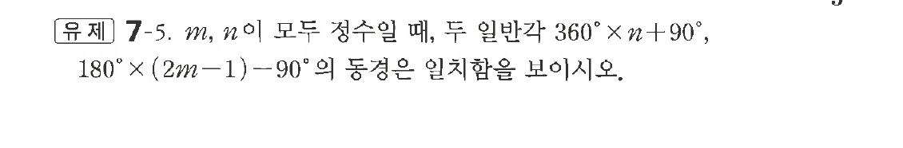
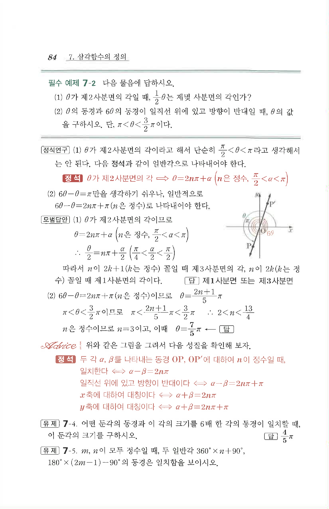

# 유제 7-5

## 문제

$m,\ n$이 모두 정수일 때, 두 일반각 $360^\circ\times n+90^\circ,\ 180^\circ\times(2m-1)-90^\circ$의 동경은 일치함을 보이시오.

## 정답

$180^\circ(2m-1)-90^\circ=360^\circ(m-1)+90^\circ$이므로 두 각은 모두 $90^\circ$의 동경을 갖는다.

## 원문 문제

## 원문

