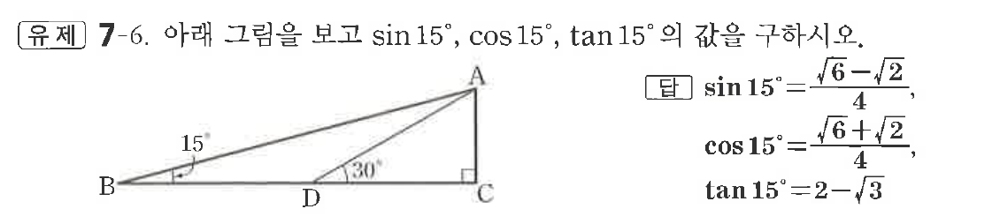

# 유제 7-6

## 문제

직각삼각형 $ABC$에서 $\angle C=90^\circ$이고, 점 $D$는 선분 $BC$ 위에 있다. $\angle ABC=15^\circ,\ \angle ADC=30^\circ$일 때, $\sin15^\circ,\ \cos15^\circ,\ \tan15^\circ$의 값을 구하시오.

## 정답

$\sin15^\circ=\dfrac{\sqrt6-\sqrt2}{4}$  
$\cos15^\circ=\dfrac{\sqrt6+\sqrt2}{4}$  
$\tan15^\circ=2-\sqrt3$

## 원문 문제

## 원문

