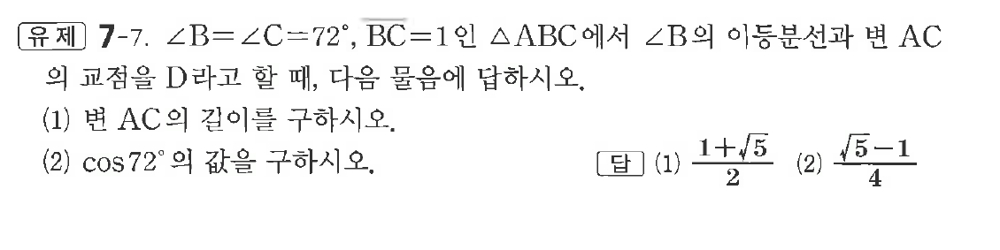
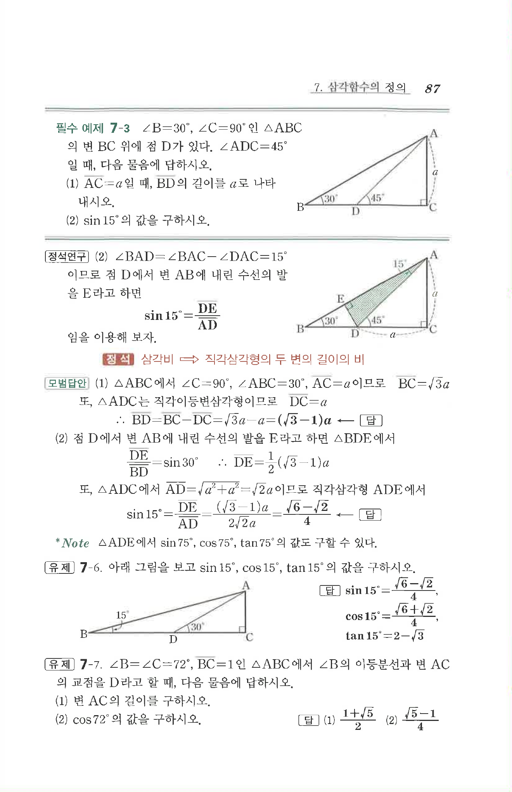

# 유제 7-7

## 문제

$\angle B=\angle C=72^\circ,\ \overline{BC}=1$인 $\triangle ABC$에서 $\angle B$의 이등분선과 변 $AC$의 교점을 $D$라고 할 때, 다음 물음에 답하시오.

(1) 변 $AC$의 길이를 구하시오.

(2) $\cos72^\circ$의 값을 구하시오.

## 정답

(1) $\dfrac{1+\sqrt5}{2}$  
(2) $\dfrac{\sqrt5-1}{4}$

## 원문 문제

## 원문

