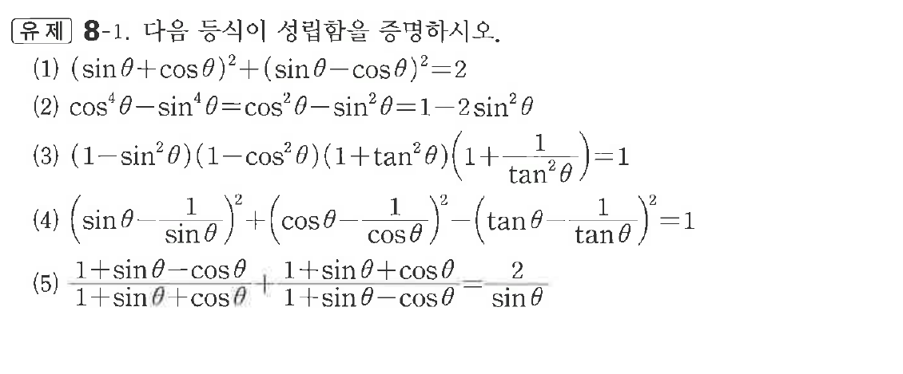
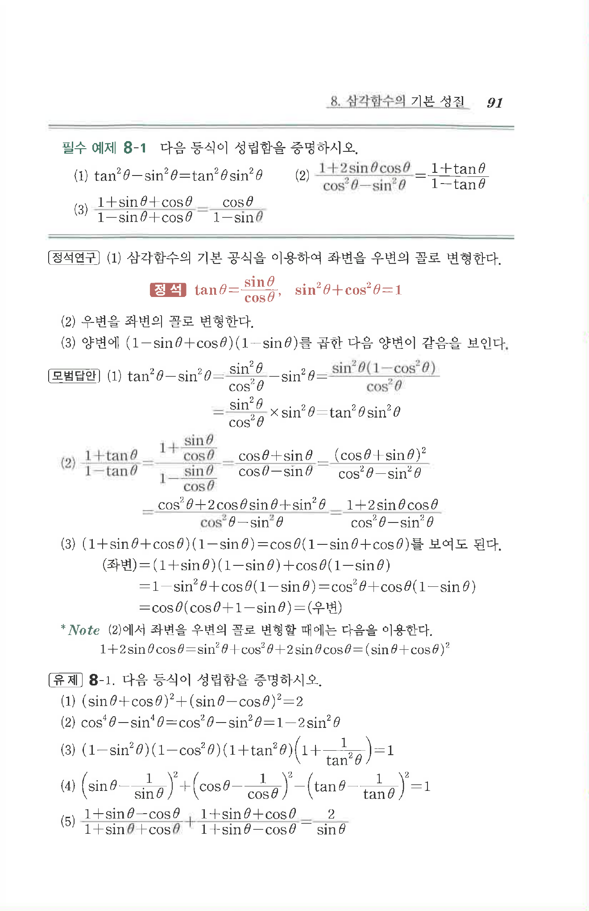

# 유제 8-1

## 문제

다음 등식이 성립함을 증명하시오.

(1) $(\sin\theta+\cos\theta)^2+(\sin\theta-\cos\theta)^2=2$

(2) $\cos^4\theta-\sin^4\theta=\cos^2\theta-\sin^2\theta=1-2\sin^2\theta$

(3) $(1-\sin^2\theta)(1-\cos^2\theta)(1+\tan^2\theta)\left(1+\dfrac1{\tan^2\theta}\right)=1$

(4) $\left(\sin\theta-\dfrac1{\sin\theta}\right)^2+\left(\cos\theta-\dfrac1{\cos\theta}\right)^2-\left(\tan\theta-\dfrac1{\tan\theta}\right)^2=1$

(5) $\dfrac{1+\sin\theta-\cos\theta}{1+\sin\theta+\cos\theta}+\dfrac{1+\sin\theta+\cos\theta}{1+\sin\theta-\cos\theta}=\dfrac2{\sin\theta}$

## 원문 문제

## 원문

