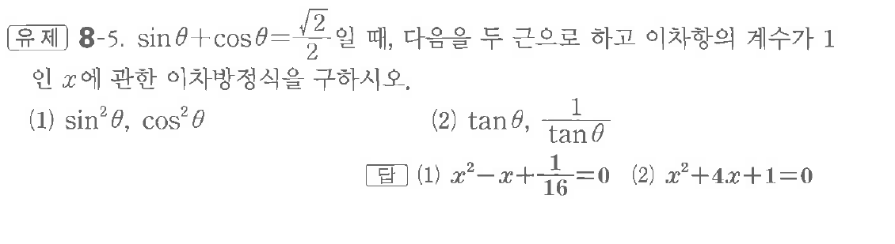
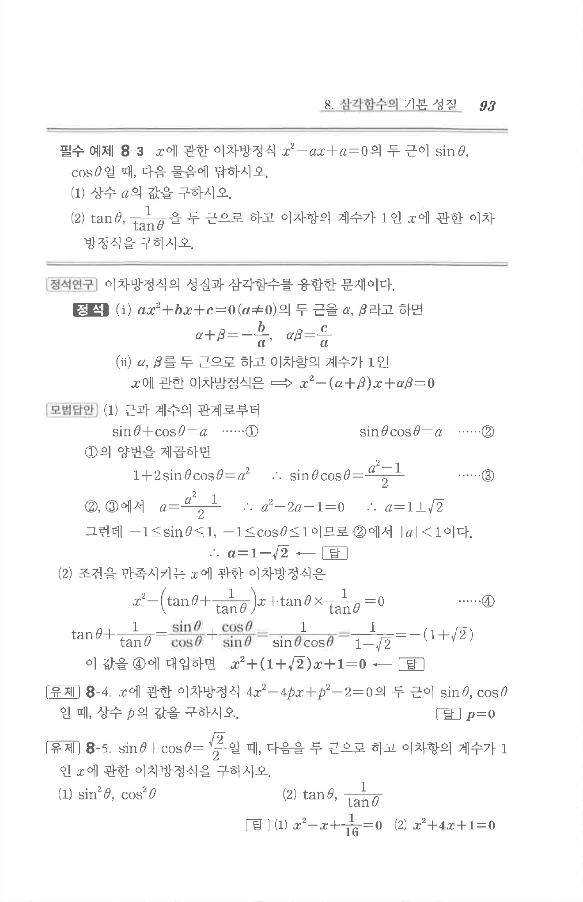

# 유제 8-5

## 문제

$\sin\theta+\cos\theta=\dfrac{\sqrt2}{2}$일 때, 다음을 두 근으로 하고 이차항의 계수가 $1$인 $x$에 관한 이차방정식을 구하시오.

(1) $\sin^2\theta,\ \cos^2\theta$

(2) $\tan\theta,\ \dfrac1{\tan\theta}$

## 정답

(1) $x^2-x+\dfrac1{16}=0$  
(2) $x^2+4x+1=0$

## 원문 문제

## 원문

