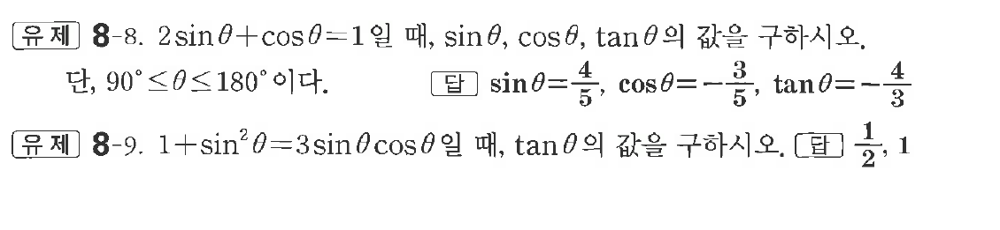
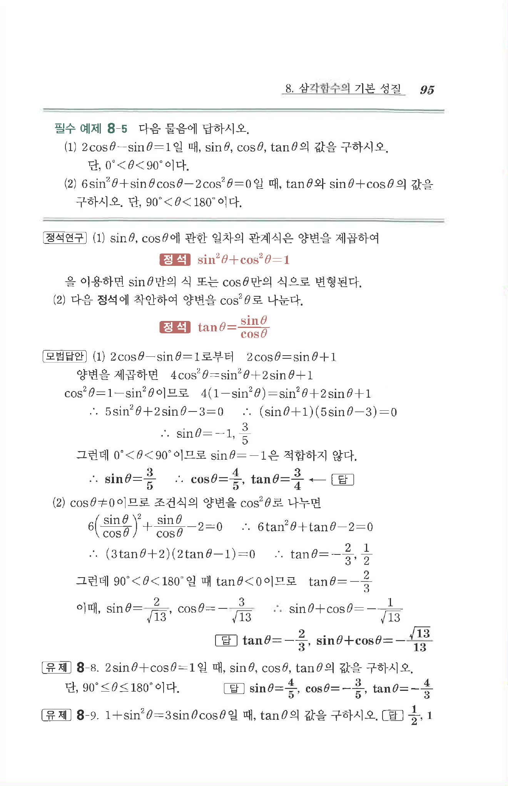

# 유제 8-8

## 문제

$2\sin\theta+\cos\theta=1$일 때, $\sin\theta,\ \cos\theta,\ \tan\theta$의 값을 구하시오. 단, $90^\circ\le\theta\le180^\circ$이다.

$1+\sin^2\theta=3\sin\theta\cos\theta$일 때, $\tan\theta$의 값을 구하시오.

## 정답

첫 번째 문제: $\sin\theta=\dfrac45,\quad \cos\theta=-\dfrac35,\quad \tan\theta=-\dfrac43$

두 번째 문제: $\dfrac12,\ 1$

## 원문 문제

## 원문

