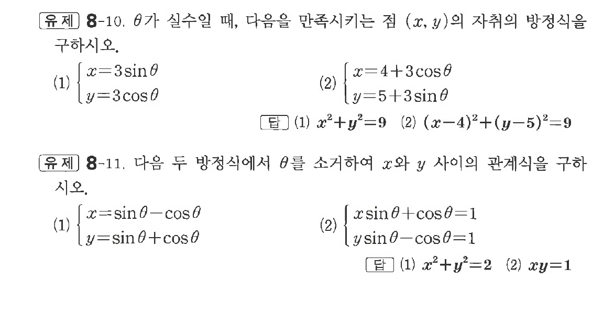

# 유제 8-10

## 문제

$\theta$가 실수일 때, 다음을 만족시키는 점 $(x,\ y)$의 자취의 방정식을 구하시오.

(1) $\begin{cases}x=3\sin\theta\\y=3\cos\theta\end{cases}$

(2) $\begin{cases}x=4+3\cos\theta\\y=5+3\sin\theta\end{cases}$

다음 두 방정식에서 $\theta$를 소거하여 $x$와 $y$ 사이의 관계식을 구하시오.

(1) $\begin{cases}x=\sin\theta-\cos\theta\\y=\sin\theta+\cos\theta\end{cases}$

(2) $\begin{cases}x\sin\theta+\cos\theta=1\\y\sin\theta-\cos\theta=1\end{cases}$

## 정답

첫 번째 문제: (1) $x^2+y^2=9$  (2) $(x-4)^2+(y-5)^2=9$

두 번째 문제: (1) $x^2+y^2=2$  (2) $xy=1$

## 원문 문제

## 원문

