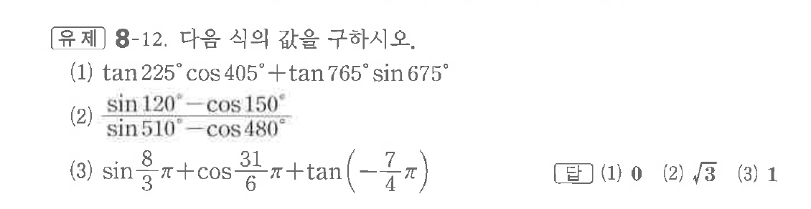
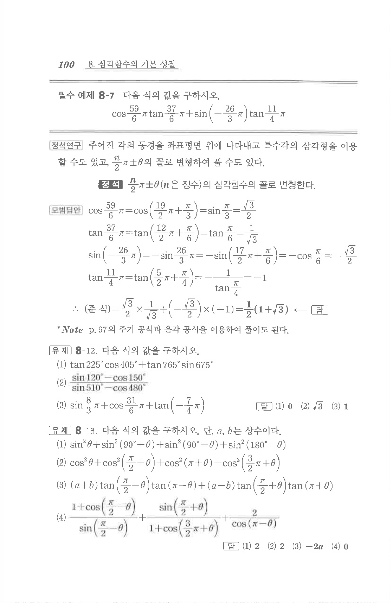

# 유제 8-12

## 문제

다음 식의 값을 구하시오.

(1) $\tan225^\circ\cos405^\circ+\tan765^\circ\sin675^\circ$

(2) $\dfrac{\sin120^\circ-\cos150^\circ}{\sin510^\circ-\cos480^\circ}$

(3) $\sin\dfrac83\pi+\cos\dfrac{31}{6}\pi+\tan\left(-\dfrac74\pi\right)$

## 정답

(1) $0$  
(2) $\sqrt3$  
(3) $1$

## 원문 문제

## 원문

