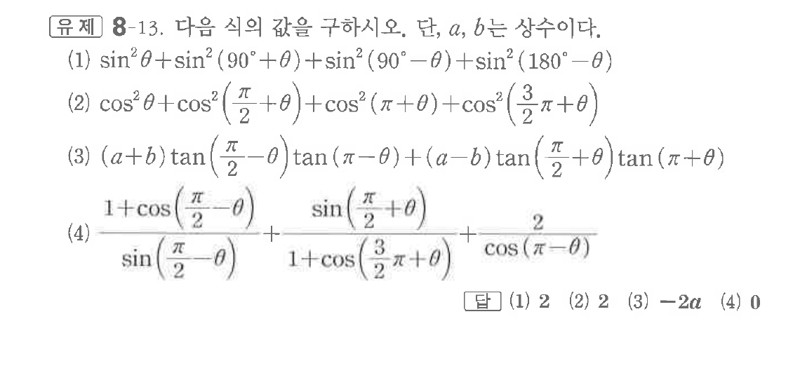

# 유제 8-13

## 문제

다음 식의 값을 구하시오. 단, $a,\ b$는 상수이다.

(1) $\sin^2\theta+\sin^2(90^\circ+\theta)+\sin^2(90^\circ-\theta)+\sin^2(180^\circ-\theta)$

(2) $\cos^2\theta+\cos^2\left(\dfrac\pi2+\theta\right)+\cos^2(\pi+\theta)+\cos^2\left(\dfrac32\pi+\theta\right)$

(3) $(a+b)\tan\left(\dfrac\pi2-\theta\right)\tan(\pi-\theta)+(a-b)\tan\left(\dfrac\pi2+\theta\right)\tan(\pi+\theta)$

(4) $\dfrac{1+\cos\left(\dfrac\pi2-\theta\right)}{\sin\left(\dfrac\pi2-\theta\right)}+\dfrac{\sin\left(\dfrac\pi2+\theta\right)}{1+\cos\left(\dfrac32\pi+\theta\right)}+\dfrac2{\cos(\pi-\theta)}$

## 정답

(1) $2$  
(2) $2$  
(3) $-2a$  
(4) $0$

## 원문 문제

## 원문

