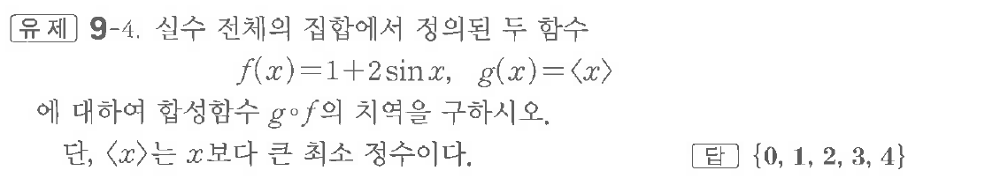
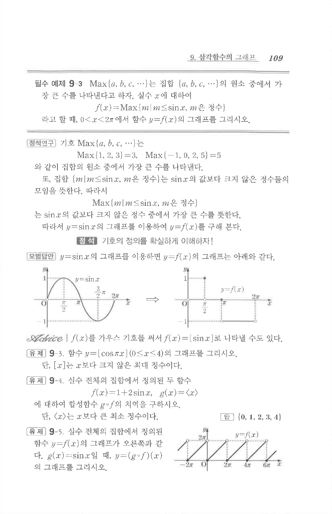

# 유제 9-4

## 문제

실수 전체의 집합에서 정의된 두 함수

$$
f(x)=1+2\sin x,\quad g(x)=\langle x\rangle
$$

에 대하여 합성함수 $g\circ f$의 치역을 구하시오.

단, $\langle x\rangle$는 $x$보다 큰 최소 정수이다.

## 정답

$\{0,\ 1,\ 2,\ 3,\ 4\}$

## 원문 문제

## 원문

