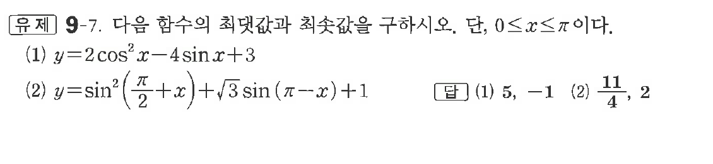
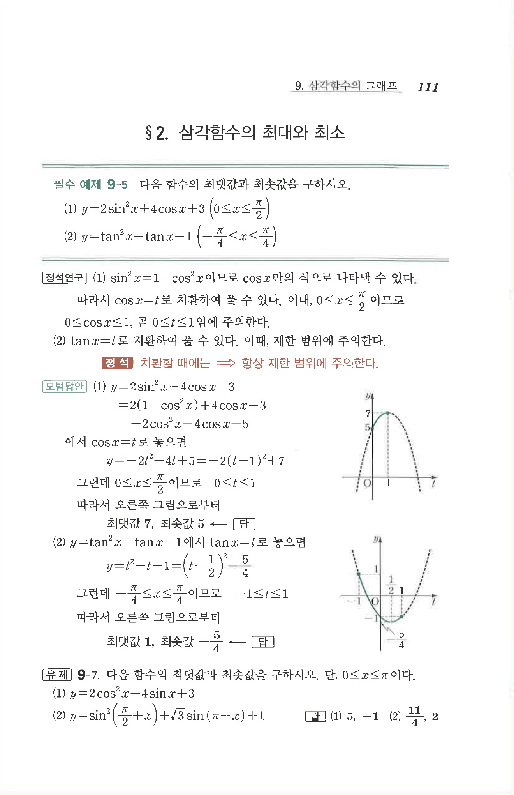

# 유제 9-7

## 문제

다음 함수의 최댓값과 최솟값을 구하시오. 단, $0\le x\le\pi$이다.

(1) $y=2\cos^2x-4\sin x+3$

(2) $y=\sin^2\left(\dfrac\pi2+x\right)+\sqrt3\sin(\pi-x)+1$

## 정답

(1) 최댓값 $5$, 최솟값 $-1$  
(2) 최댓값 $\dfrac{11}{4}$, 최솟값 $2$

## 원문 문제

## 원문

