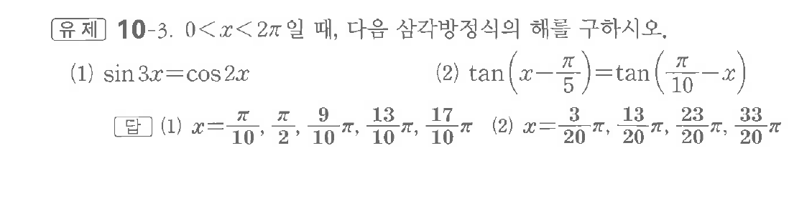
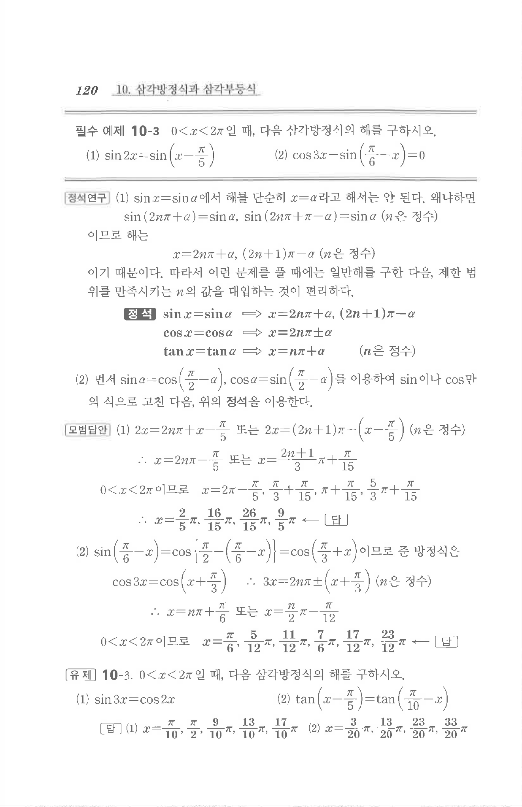

# 유제 10-3

## 문제

$0<x<2\pi$일 때, 다음 삼각방정식의 해를 구하시오.

(1) $\sin3x=\cos2x$

(2) $\tan\left(x-\dfrac\pi5\right)=\tan\left(\dfrac\pi{10}-x\right)$

## 정답

(1) $x=\dfrac\pi{10},\ \dfrac\pi2,\ \dfrac9{10}\pi,\ \dfrac{13}{10}\pi,\ \dfrac{17}{10}\pi$

(2) $x=\dfrac3{20}\pi,\ \dfrac{13}{20}\pi,\ \dfrac{23}{20}\pi,\ \dfrac{33}{20}\pi$

## 원문 문제

## 원문

