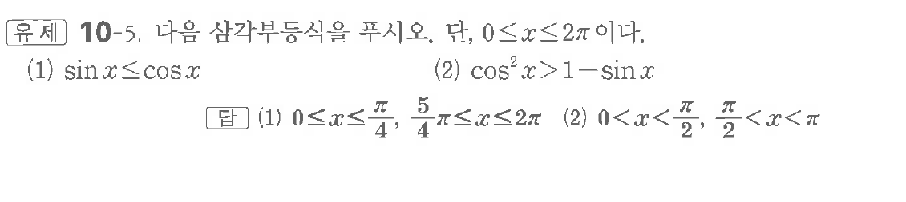

# 유제 10-5

## 문제

다음 삼각부등식을 푸시오. 단, $0\le x\le2\pi$이다.

(1) $\sin x\le\cos x$

(2) $\cos^2x>1-\sin x$

## 정답

(1) $0\le x\le\dfrac\pi4,\quad \dfrac54\pi\le x\le2\pi$

(2) $0<x<\dfrac\pi2,\quad \dfrac\pi2<x<\pi$

## 원문 문제

## 원문

