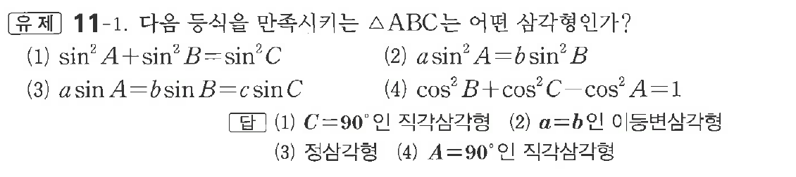

# 유제 11-1

## 문제

다음 등식을 만족시키는 $\triangle ABC$는 어떤 삼각형인가?

(1) $\sin^2A+\sin^2B=\sin^2C$

(2) $a\sin^2A=b\sin^2B$

(3) $a\sin A=b\sin B=c\sin C$

(4) $\cos^2B+\cos^2C-\cos^2A=1$

## 정답

(1) $C=90^\circ$인 직각삼각형  
(2) $a=b$인 이등변삼각형  
(3) 정삼각형  
(4) $A=90^\circ$인 직각삼각형

## 원문 문제

## 원문

