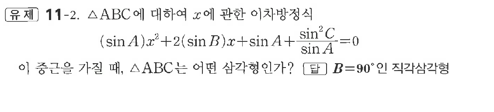
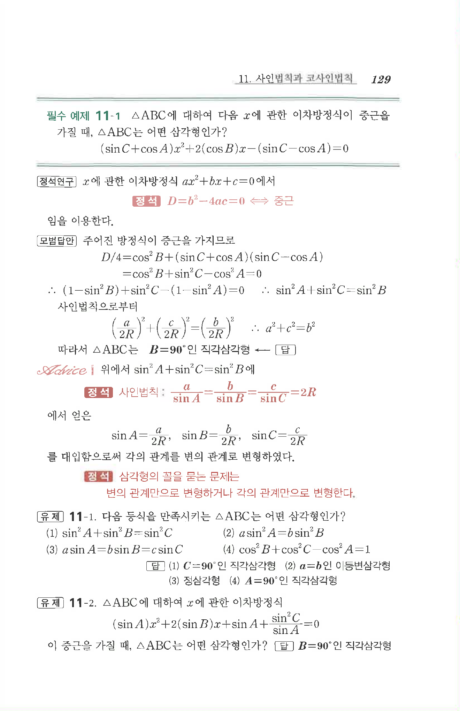

# 유제 11-2

## 문제

$\triangle ABC$에 대하여 $x$에 관한 이차방정식

$$
(\sin A)x^2+2(\sin B)x+\sin A+\frac{\sin^2C}{\sin A}=0
$$

이 중근을 가질 때, $\triangle ABC$는 어떤 삼각형인가?

## 정답

$B=90^\circ$인 직각삼각형

## 원문 문제

## 원문

