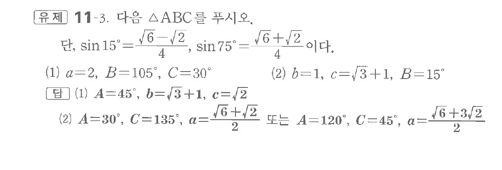
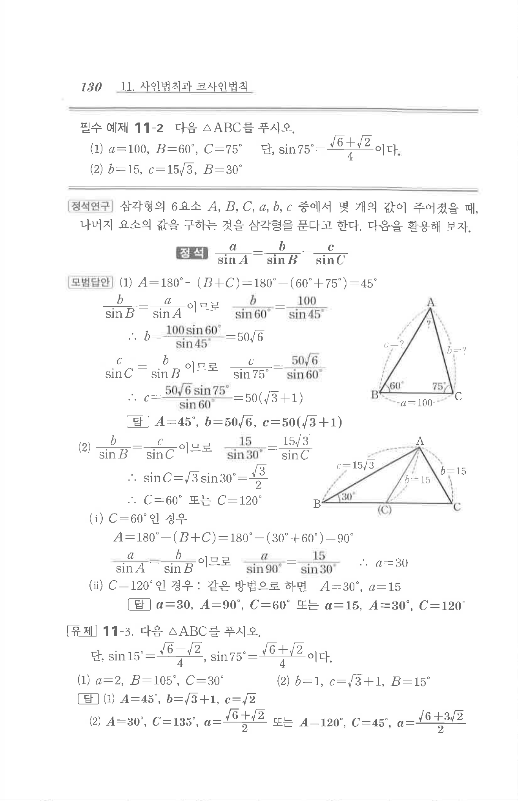

# 유제 11-3

## 문제

다음 $\triangle ABC$를 푸시오.

단, $\sin15^\circ=\dfrac{\sqrt6-\sqrt2}{4},\ \sin75^\circ=\dfrac{\sqrt6+\sqrt2}{4}$이다.

(1) $a=2,\ B=105^\circ,\ C=30^\circ$

(2) $b=1,\ c=\sqrt3+1,\ B=15^\circ$

## 정답

(1) $A=45^\circ,\ b=\sqrt3+1,\ c=\sqrt2$

(2) $A=30^\circ,\ C=135^\circ,\ a=\dfrac{\sqrt6+\sqrt2}{2}$ 또는 $A=120^\circ,\ C=45^\circ,\ a=\dfrac{\sqrt6+3\sqrt2}{2}$

## 원문 문제

## 원문

