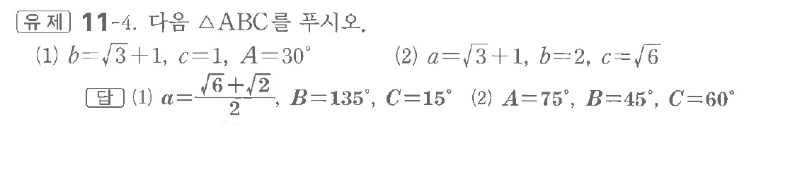

# 유제 11-4

## 문제

다음 $\triangle ABC$를 푸시오.

(1) $b=\sqrt3+1,\ c=1,\ A=30^\circ$

(2) $a=\sqrt3+1,\ b=2,\ c=\sqrt6$

## 정답

(1) $a=\dfrac{\sqrt6+\sqrt2}{2},\ B=135^\circ,\ C=15^\circ$

(2) $A=75^\circ,\ B=45^\circ,\ C=60^\circ$

## 원문 문제

## 원문

