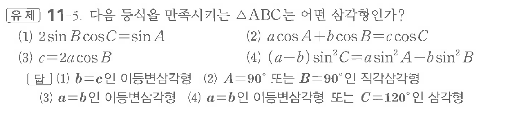
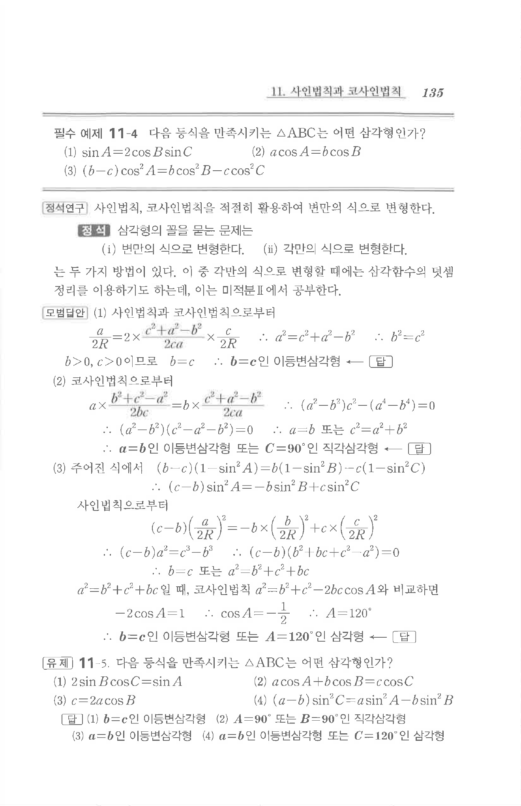

# 유제 11-5

## 문제

다음 등식을 만족시키는 $\triangle ABC$는 어떤 삼각형인가?

(1) $2\sin B\cos C=\sin A$

(2) $a\cos A+b\cos B=c\cos C$

(3) $c=2a\cos B$

(4) $(a-b)\sin^2C=a\sin^2A-b\sin^2B$

## 정답

(1) $b=c$인 이등변삼각형  
(2) $A=90^\circ$ 또는 $B=90^\circ$인 직각삼각형  
(3) $a=b$인 이등변삼각형  
(4) $a=b$인 이등변삼각형 또는 $C=120^\circ$인 삼각형

## 원문 문제

## 원문

