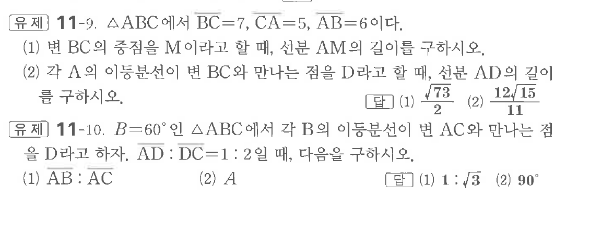

# 유제 11-9

## 문제

$\triangle ABC$에서 $\overline{BC}=7,\ \overline{CA}=5,\ \overline{AB}=6$이다.

(1) 변 $BC$의 중점을 $M$이라고 할 때, 선분 $AM$의 길이를 구하시오.

(2) 각 $A$의 이등분선이 변 $BC$와 만나는 점을 $D$라고 할 때, 선분 $AD$의 길이를 구하시오.

$B=60^\circ$인 $\triangle ABC$에서 각 $B$의 이등분선이 변 $AC$와 만나는 점을 $D$라고 하자. $\overline{AD}:\overline{DC}=1:2$일 때, 다음을 구하시오.

(1) $\overline{AB}:\overline{AC}$

(2) $A$

## 정답

첫 번째 문제: (1) $\dfrac{\sqrt{73}}2$  (2) $\dfrac{12\sqrt{15}}{11}$

두 번째 문제: (1) $1:\sqrt3$  (2) $90^\circ$

## 원문 문제

## 원문

