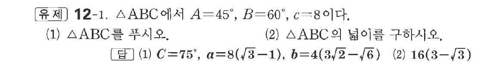

# 유제 12-1

## 문제

$\triangle ABC$에서 $A=45^\circ,\ B=60^\circ,\ c=8$이다.

(1) $\triangle ABC$를 푸시오.

(2) $\triangle ABC$의 넓이를 구하시오.

## 정답

(1) $C=75^\circ,\ a=8(\sqrt3-1),\ b=4(3\sqrt2-\sqrt6)$  
(2) $16(3-\sqrt3)$

## 원문 문제

## 원문

