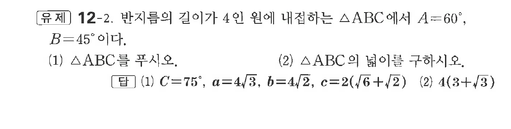

# 유제 12-2

## 문제

반지름의 길이가 $4$인 원에 내접하는 $\triangle ABC$에서 $A=60^\circ,\ B=45^\circ$이다.

(1) $\triangle ABC$를 푸시오.

(2) $\triangle ABC$의 넓이를 구하시오.

## 정답

(1) $C=75^\circ,\ a=4\sqrt3,\ b=4\sqrt2,\ c=2(\sqrt6+\sqrt2)$  
(2) $4(3+\sqrt3)$

## 원문 문제

## 원문

