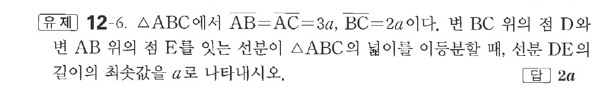

# 유제 12-6

## 문제

$\triangle ABC$에서 $\overline{AB}=\overline{AC}=3a,\ \overline{BC}=2a$이다. 변 $BC$ 위의 점 $D$와 변 $AB$ 위의 점 $E$를 잇는 선분이 $\triangle ABC$의 넓이를 이등분할 때, 선분 $DE$의 길이의 최솟값을 $a$로 나타내시오.

## 정답

$2a$

## 원문 문제

## 원문

