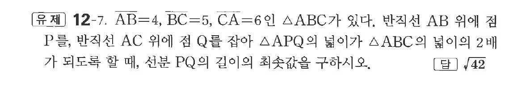
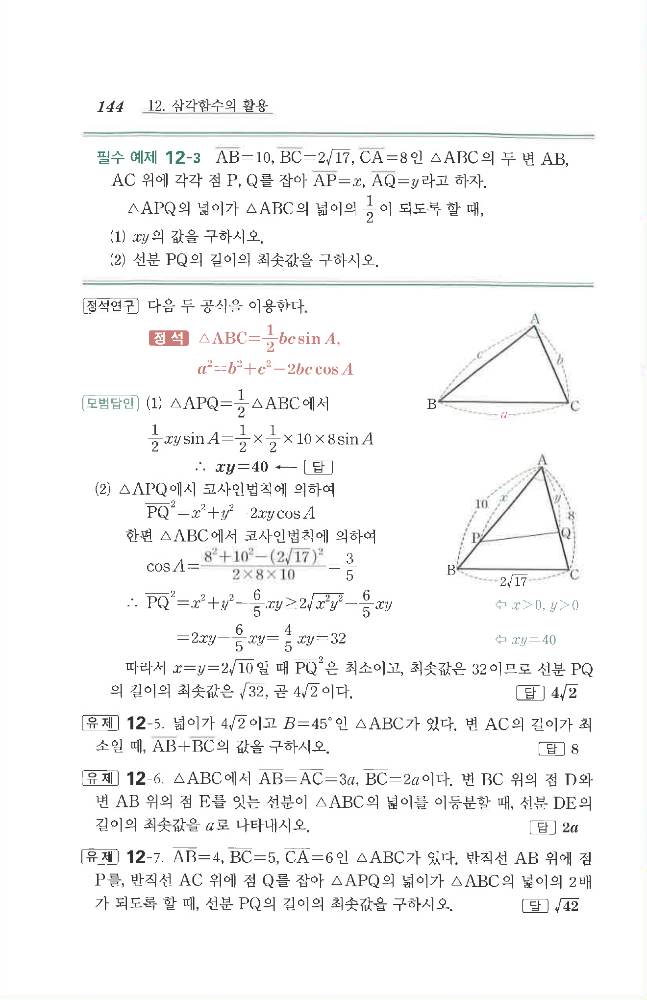

# 유제 12-7

## 문제

$\overline{AB}=4,\ \overline{BC}=5,\ \overline{CA}=6$인 $\triangle ABC$가 있다. 반직선 $AB$ 위에 점 $P$를, 반직선 $AC$ 위에 점 $Q$를 잡아 $\triangle APQ$의 넓이가 $\triangle ABC$의 넓이의 $2$배가 되도록 할 때, 선분 $PQ$의 길이의 최솟값을 구하시오.

## 정답

$\sqrt{42}$

## 원문 문제

## 원문

