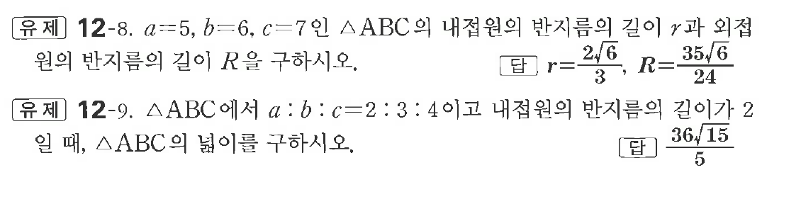

# 유제 12-8

## 문제

$a=5,\ b=6,\ c=7$인 $\triangle ABC$의 내접원의 반지름의 길이 $r$과 외접원의 반지름의 길이 $R$을 구하시오.

$\triangle ABC$에서 $a:b:c=2:3:4$이고 내접원의 반지름의 길이가 $2$일 때, $\triangle ABC$의 넓이를 구하시오.

## 정답

첫 번째 문제: $r=\dfrac{2\sqrt6}{3},\quad R=\dfrac{35\sqrt6}{24}$

두 번째 문제: $\dfrac{36\sqrt{15}}5$

## 원문 문제

## 원문

