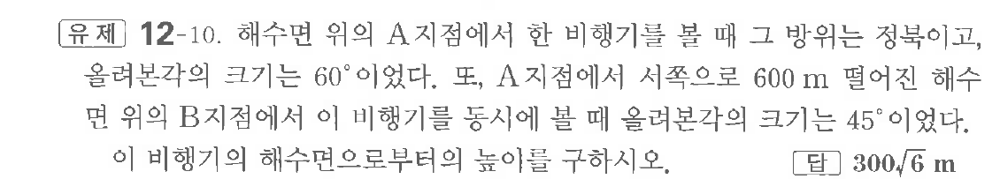

# 유제 12-10

## 문제

해수면 위의 $A$지점에서 한 비행기를 볼 때 그 방위는 정북이고, 올려본각의 크기는 $60^\circ$이었다. 또, $A$지점에서 서쪽으로 $600\text{ m}$ 떨어진 해수면 위의 $B$지점에서 이 비행기를 동시에 볼 때 올려본각의 크기는 $45^\circ$이었다. 이 비행기의 해수면으로부터의 높이를 구하시오.

## 정답

$300\sqrt6\text{ m}$

## 원문 문제

## 원문

