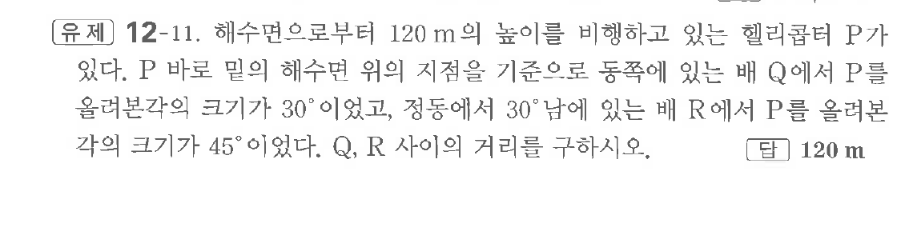
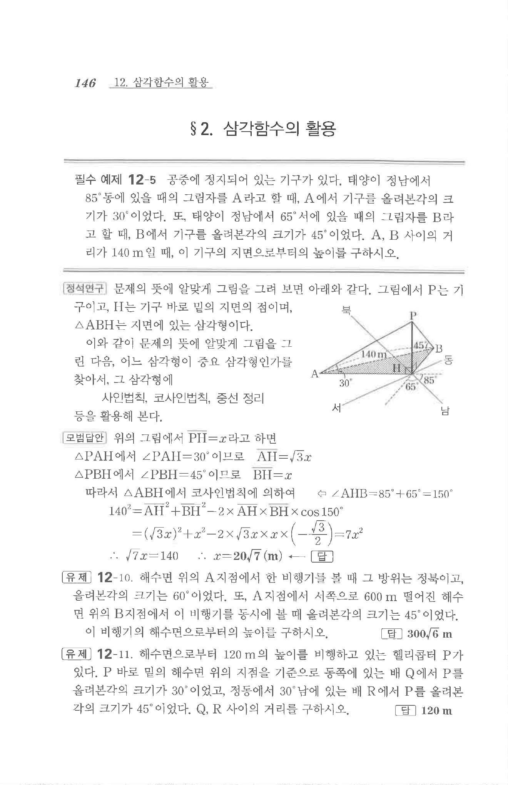

# 유제 12-11

## 문제

해수면으로부터 $120\text{ m}$의 높이를 비행하고 있는 헬리콥터 $P$가 있다. $P$ 바로 밑의 해수면 위의 지점을 기준으로 동쪽에 있는 배 $Q$에서 $P$를 올려본각의 크기가 $30^\circ$이었고, 정동에서 $30^\circ$ 남에 있는 배 $R$에서 $P$를 올려본각의 크기가 $45^\circ$이었다. $Q,\ R$ 사이의 거리를 구하시오.

## 정답

$120\text{ m}$

## 원문 문제

## 원문

