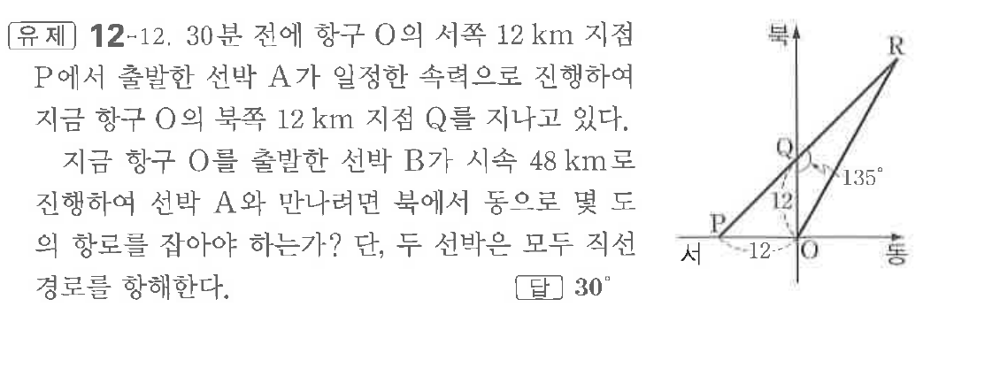
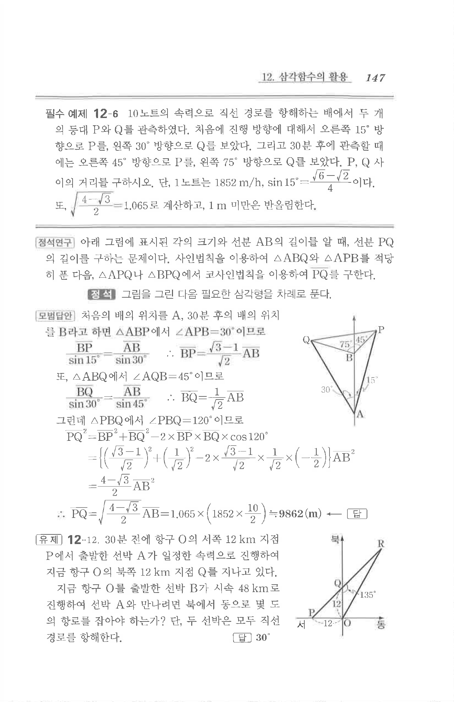

# 유제 12-12

## 문제

$30$분 전에 항구 $O$의 서쪽 $12\text{ km}$ 지점 $P$에서 출발한 선박 $A$가 일정한 속력으로 진행하여 지금 항구 $O$의 북쪽 $12\text{ km}$ 지점 $Q$를 지나고 있다. 지금 항구 $O$를 출발한 선박 $B$가 시속 $48\text{ km}$로 진행하여 선박 $A$와 만나려면 북에서 동으로 몇 도의 항로를 잡아야 하는가? 단, 두 선박은 모두 직선 경로를 항해한다.

## 정답

$30^\circ$

## 원문 문제

## 원문

