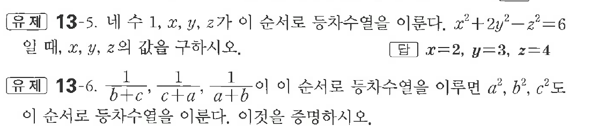

# 유제 13-5

## 문제

네 수 $1,\ x,\ y,\ z$가 이 순서로 등차수열을 이룬다. $x^2+2y^2-z^2=6$일 때, $x,\ y,\ z$의 값을 구하시오.

$\dfrac1{b+c},\ \dfrac1{c+a},\ \dfrac1{a+b}$이 이 순서로 등차수열을 이루면 $a^2,\ b^2,\ c^2$도 이 순서로 등차수열을 이룬다. 이것을 증명하시오.

## 정답

첫 번째 문제: $x=2,\ y=3,\ z=4$

## 원문 문제

## 원문

