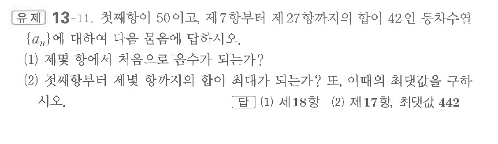
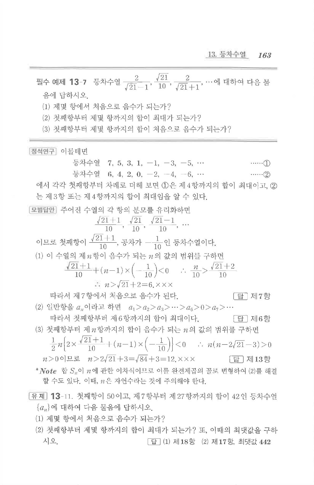

# 유제 13-11

## 문제

첫째항이 $50$이고, 제$7$항부터 제$27$항까지의 합이 $42$인 등차수열 $\{a_n\}$에 대하여 다음 물음에 답하시오.

(1) 제몇 항에서 처음으로 음수가 되는가?

(2) 첫째항부터 제몇 항까지의 합이 최대가 되는가? 또, 이때의 최댓값을 구하시오.

## 정답

(1) 제$18$항  
(2) 제$17$항, 최댓값 $442$

## 원문 문제

## 원문

