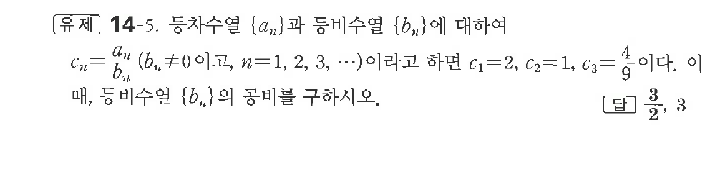
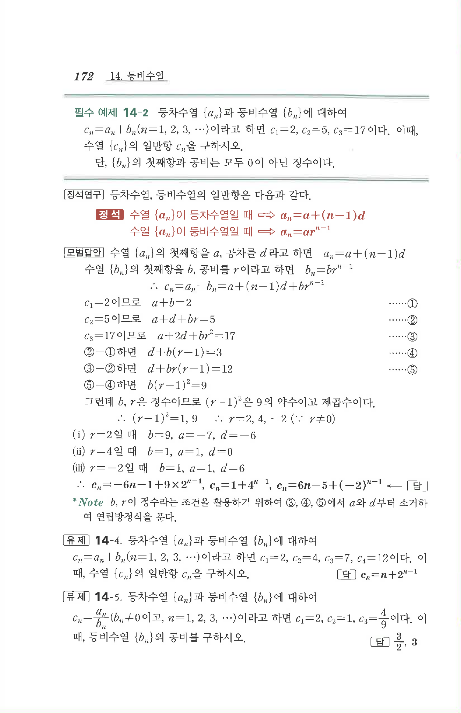

# 유제 14-5

## 문제

등차수열 $\{a_n\}$과 등비수열 $\{b_n\}$에 대하여

$$
c_n=\frac{a_n}{b_n}\quad(b_n\ne0,\ n=1,2,3,\cdots)
$$

이라고 하면 $c_1=2,\ c_2=1,\ c_3=\dfrac49$이다. 이때, 등비수열 $\{b_n\}$의 공비를 구하시오.

## 정답

$\dfrac32,\ 3$

## 원문 문제

## 원문

