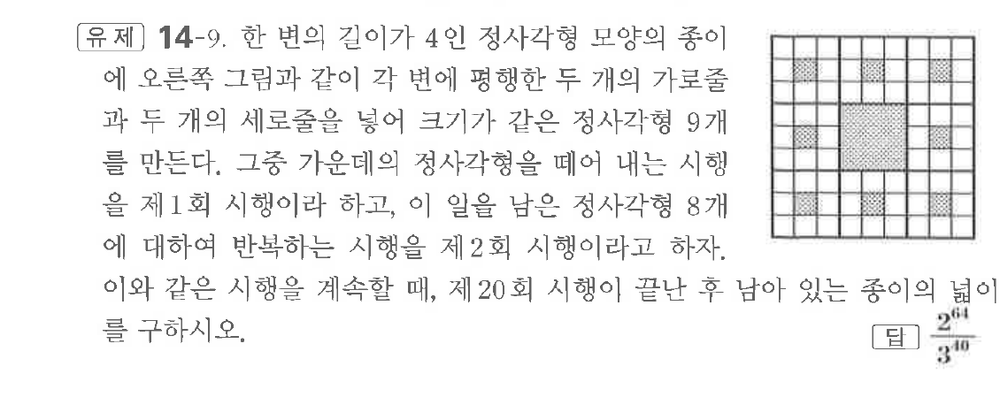
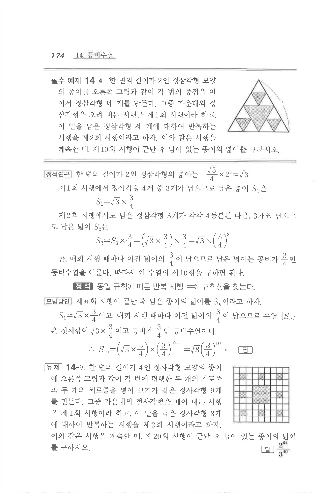

# 유제 14-9

## 문제

한 변의 길이가 $4$인 정사각형 모양의 종이에 오른쪽 그림과 같이 각 변에 평행한 두 개의 가로줄과 두 개의 세로줄을 넣어 크기가 같은 정사각형 $9$개를 만든다. 그중 가운데의 정사각형을 떼어 내는 시행을 제$1$회 시행이라 하고, 이 일을 남은 정사각형 $8$개에 대하여 반복하는 시행을 제$2$회 시행이라고 하자. 이와 같은 시행을 계속할 때, 제$20$회 시행이 끝난 후 남아 있는 종이의 넓이를 구하시오.

## 정답

$\dfrac{2^{64}}{3^{40}}$

## 원문 문제

## 원문

