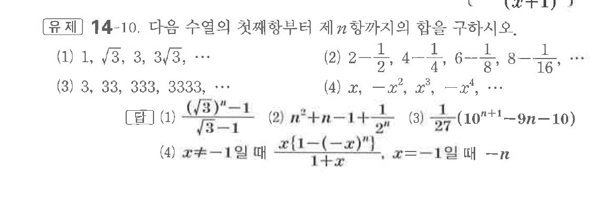
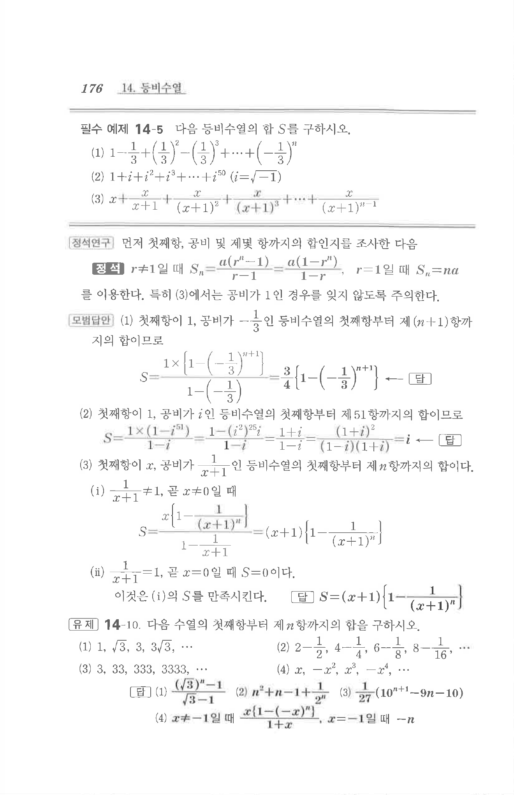

# 유제 14-10

## 문제

다음 수열의 첫째항부터 제$n$항까지의 합을 구하시오.

(1) $1,\ \sqrt3,\ 3,\ 3\sqrt3,\ \cdots$

(2) $2-\dfrac12,\ 4-\dfrac14,\ 6-\dfrac18,\ 8-\dfrac1{16},\ \cdots$

(3) $3,\ 33,\ 333,\ 3333,\ \cdots$

(4) $x,\ -x^2,\ x^3,\ -x^4,\ \cdots$

## 정답

(1) $\dfrac{(\sqrt3)^n-1}{\sqrt3-1}$

(2) $n^2+n-1+\dfrac1{2^n}$

(3) $\dfrac1{27}(10^{n+1}-9n-10)$

(4) $x\ne-1$일 때 $\dfrac{x\{1-(-x)^n\}}{1+x}$, $x=-1$일 때 $-n$

## 원문 문제

## 원문

