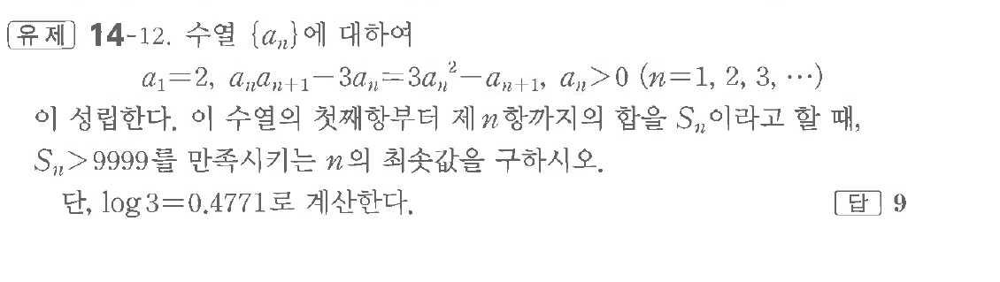

# 유제 14-12

## 문제

수열 $\{a_n\}$에 대하여

$$
a_1=2,\quad a_na_{n+1}-3a_n=3a_n^2-a_{n+1},\quad a_n>0\quad(n=1,2,3,\cdots)
$$

이 성립한다. 이 수열의 첫째항부터 제$n$항까지의 합을 $S_n$이라고 할 때, $S_n>9999$를 만족시키는 $n$의 최솟값을 구하시오.

단, $\log3=0.4771$로 계산한다.

## 정답

$9$

## 원문 문제

## 원문

