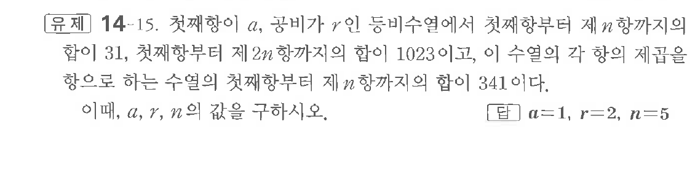
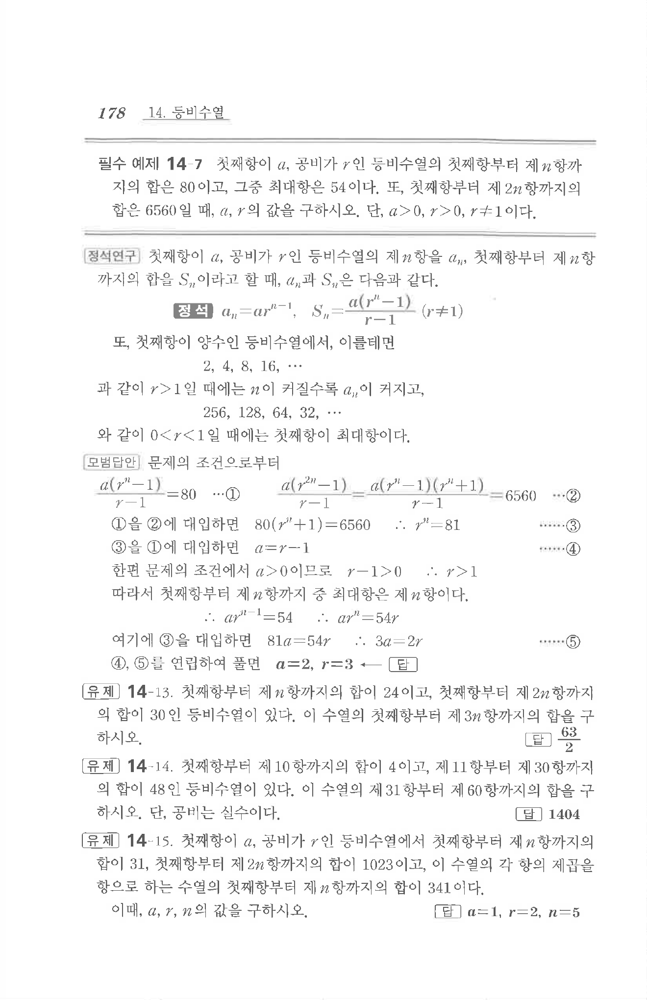

# 유제 14-15

## 문제

첫째항이 $a$, 공비가 $r$인 등비수열에서 첫째항부터 제$n$항까지의 합이 $31$, 첫째항부터 제$2n$항까지의 합이 $1023$이고, 이 수열의 각 항의 제곱을 항으로 하는 수열의 첫째항부터 제$n$항까지의 합이 $341$이다. 이때, $a,\ r,\ n$의 값을 구하시오.

## 정답

$a=1,\quad r=2,\quad n=5$

## 원문 문제

## 원문

