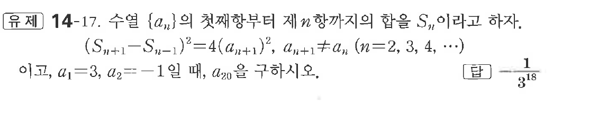

# 유제 14-17

## 문제

수열 $\{a_n\}$의 첫째항부터 제$n$항까지의 합을 $S_n$이라고 하자.

$$
(S_{n+1}-S_{n-1})^2=4(a_{n+1})^2,\quad a_{n+1}\ne a_n\quad(n=2,3,4,\cdots)
$$

이고, $a_1=3,\ a_2=-1$일 때, $a_{20}$을 구하시오.

## 정답

$-\dfrac1{3^{18}}$

## 원문 문제

## 원문

