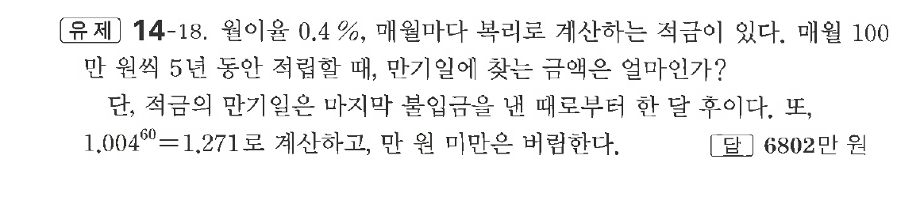

# 유제 14-18

## 문제

월이율 $0.4\%$, 매월마다 복리로 계산하는 적금이 있다. 매월 $100$만 원씩 $5$년 동안 적립할 때, 만기일에 찾는 금액은 얼마인가?

단, 적금의 만기일은 마지막 불입금을 낸 때로부터 한 달 후이다. 또, $1.004^{60}=1.271$로 계산하고, 만 원 미만은 버림한다.

## 정답

$6802$만 원

## 원문 문제

## 원문

