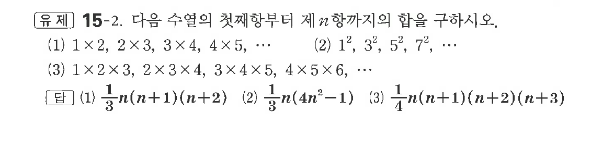
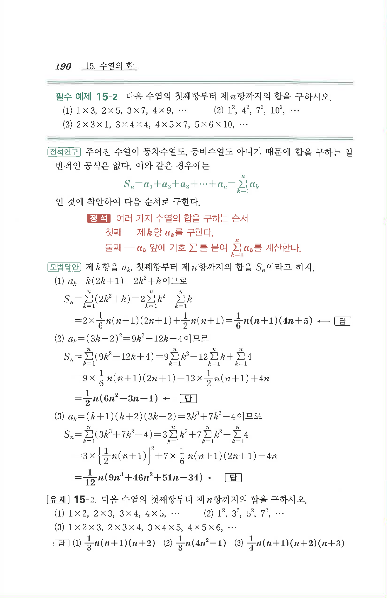

# 유제 15-2

## 문제

다음 수열의 첫째항부터 제$n$항까지의 합을 구하시오.

(1) $1\times2,\ 2\times3,\ 3\times4,\ 4\times5,\ \cdots$

(2) $1^2,\ 3^2,\ 5^2,\ 7^2,\ \cdots$

(3) $1\times2\times3,\ 2\times3\times4,\ 3\times4\times5,\ 4\times5\times6,\ \cdots$

## 정답

(1) $\dfrac13 n(n+1)(n+2)$  
(2) $\dfrac13 n(4n^2-1)$  
(3) $\dfrac14 n(n+1)(n+2)(n+3)$

## 원문 문제

## 원문

