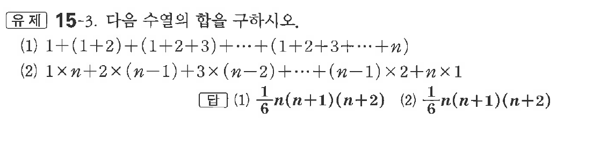
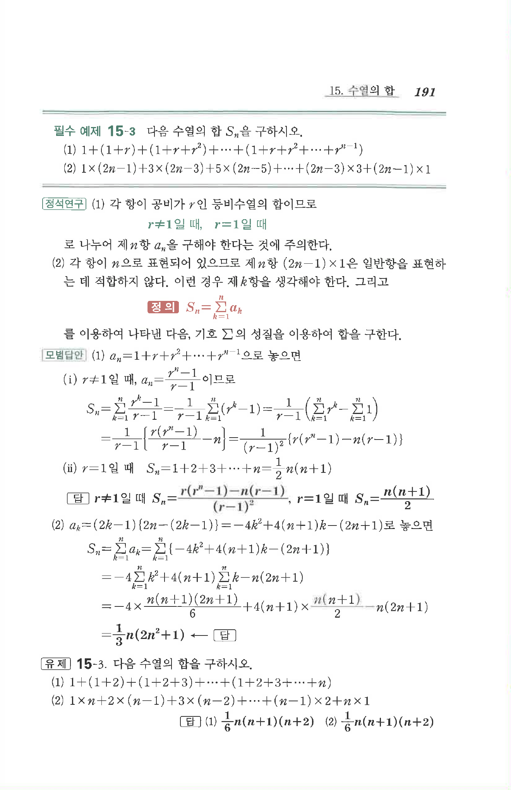

# 유제 15-3

## 문제

다음 수열의 합을 구하시오.

(1) $1+(1+2)+(1+2+3)+\cdots+(1+2+3+\cdots+n)$

(2) $1\times n+2\times(n-1)+3\times(n-2)+\cdots+(n-1)\times2+n\times1$

## 정답

(1) $\dfrac16 n(n+1)(n+2)$  
(2) $\dfrac16 n(n+1)(n+2)$

## 원문 문제

## 원문

