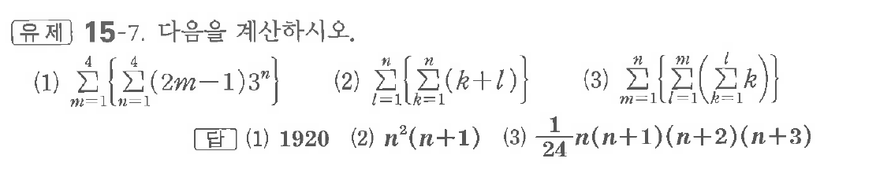

# 유제 15-7

## 문제

다음을 계산하시오.

(1) $\displaystyle\sum_{m=1}^{4}\left\{\sum_{n=1}^{4}(2m-1)3^n\right\}$

(2) $\displaystyle\sum_{l=1}^{n}\left\{\sum_{k=1}^{n}(k+l)\right\}$

(3) $\displaystyle\sum_{m=1}^{n}\left\{\sum_{l=1}^{m}\left(\sum_{k=1}^{l}k\right)\right\}$

## 정답

(1) $1920$  
(2) $n^2(n+1)$  
(3) $\dfrac1{24}n(n+1)(n+2)(n+3)$

## 원문 문제

## 원문

