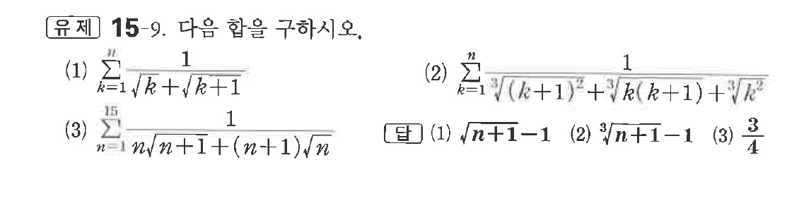

# 유제 15-9

## 문제

다음 합을 구하시오.

(1) $\displaystyle\sum_{k=1}^{n}\frac1{\sqrt{k}+\sqrt{k+1}}$

(2) $\displaystyle\sum_{k=1}^{n}\frac1{\sqrt[3]{(k+1)^2}+\sqrt[3]{k(k+1)}+\sqrt[3]{k^2}}$

(3) $\displaystyle\sum_{n=1}^{15}\frac1{n\sqrt{n+1}+(n+1)\sqrt n}$

## 정답

(1) $\sqrt{n+1}-1$  
(2) $\sqrt[3]{n+1}-1$  
(3) $\dfrac34$

## 원문 문제

## 원문

