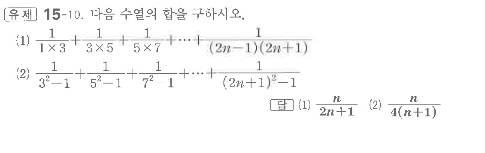

# 유제 15-10

## 문제

다음 수열의 합을 구하시오.

(1) $\dfrac1{1\times3}+\dfrac1{3\times5}+\dfrac1{5\times7}+\cdots+\dfrac1{(2n-1)(2n+1)}$

(2) $\dfrac1{3^2-1}+\dfrac1{5^2-1}+\dfrac1{7^2-1}+\cdots+\dfrac1{(2n+1)^2-1}$

## 정답

(1) $\dfrac n{2n+1}$  
(2) $\dfrac n{4(n+1)}$

## 원문 문제

## 원문

