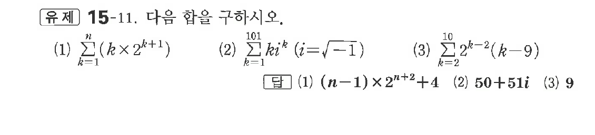
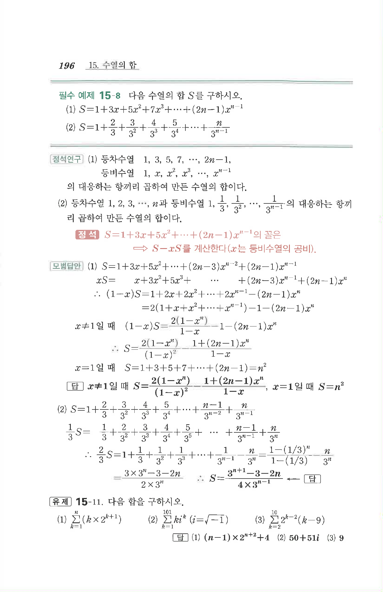

# 유제 15-11

## 문제

다음 합을 구하시오.

(1) $\displaystyle\sum_{k=1}^{n}(k\times2^{k+1})$

(2) $\displaystyle\sum_{k=1}^{101}ki^k\quad(i=\sqrt{-1})$

(3) $\displaystyle\sum_{k=2}^{10}2^{k-2}(k-9)$

## 정답

(1) $(n-1)\times2^{n+2}+4$  
(2) $50+51i$  
(3) $9$

## 원문 문제

## 원문

